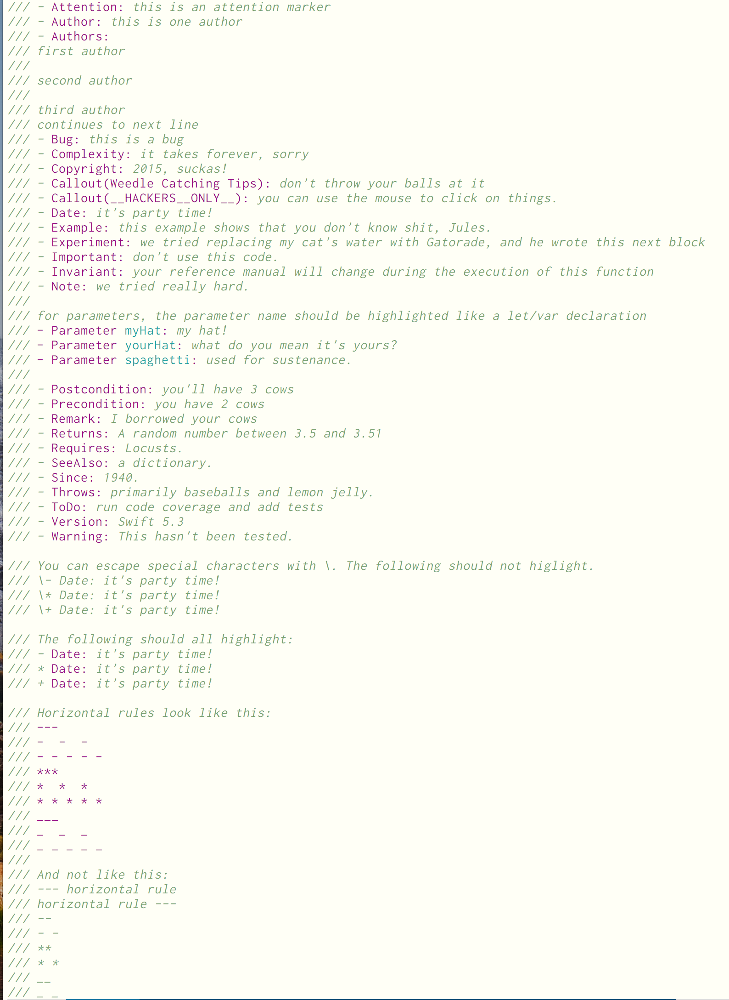

schwifty-vim
============

A humble, minimal vim plugin for Swift 4 development assembled by Brian Heim.

The syntax, ftplugin, and ftdetect files are taken from Apple's
[swift/utils/vim](https://github.com/apple/swift). Original maintainer: Joe Groff.

The indent file is taken from Keith Smiley's [keith/swift.vim](https://github.com/keith/swift.vim).

I have made modifications to both to expand syntax coverage and fix issues I noticed.

Keith Smiley's indent file is licensed under the MIT license. The remainder of this repository -
Apple's files and my modifications - are Apache-2.0 licensed. In accordance with that license, where
modifications have been made, I have left a notice at the top of the file. See LICENSE.txt and
NOTICE for details.

I made this fork because I was dissatisfied by the other Swift/Vim integrations out there (either
too bulky or not quite there yet), and wanted to move faster than Apple's review process would
allow. This is my first vim plugin. If you find it useful, please let me know. If you have
suggestions, please, _please_ let me know!

Features
--------

Some of the specific features I've added for syntax highlighting are:

- Support for doc comments `/** */`, `///`
- Support for multiline string literals `""" ... """`
- [Support for doc comment keywords](examples/syntax_doc_comments.png) like `- Returns:`, `- Parameter x:`, and `- Throws:`
- Commenting-out blocks of code that are turned off by the `#if os(myOS)` directive
- Support for all compilation directives, including `#sourceLocation`, `#selector`, and
  `#imageLiteral`

Installation
------------

With [Pathogen](https://github.com/tpope/vim-pathogen):

    git clone https://github.com/brianlheim/schwifty-vim ~/.vim/bundle/schwifty-vim
